# sdr_stream RX and TX signal path: antenna pin to/from host sample

RX (antenna in -> host sample) and TX (host sample -> antenna out) for `apps/sdr_stream`. The
two columns share one physical antenna pin and USB link (`esp_sdr_lock` makes RX/TX mutually
exclusive); drawn as separate columns to keep each one readable.

```mermaid
flowchart LR
    subgraph RX["RX: pin to host sample"]
        direction TB
        R1["`**Antenna pin**
RF in`"]
        R2["`**Analog front end**
LNA, mixer, LO, AGC, LPF`"]
        R3["`**ADC**
10-bit I/Q`"]
        R4["`**Capture engine**
HW fills a DRAM bank`"]
        R5["`**esp_sdr_rx**
raw / CIC decimate / fold`"]
        R6["`**iq_pack**
8/12/16-bit packing`"]
        R7["`**vrt_rx.c**
VITA 49.2 packet`"]
        R8["`**transport_udp.c**
UDP/IPv6 send`"]
        R9["`**USB CDC-NCM**
cdc_ncm_eth0 + UDC dwc2`"]
        R10["`**Host NIC**
esdr0`"]
        R11["`**esp_sdr_lab.py / vrt_rx.py**
decode to IQ samples`"]
        R1 --> R2 --> R3 --> R4 --> R5 --> R6 --> R7 --> R8 --> R9 --> R10 --> R11
    end

    subgraph TX["TX: host sample to pin"]
        direction TB
        T1["`**esp_sdr_lab.py txstream / vrt_tx.py**
encode VITA packets`"]
        T2["`**Host NIC**
esdr0`"]
        T3["`**USB CDC-NCM**
UDC dwc2 + cdc_ncm_eth0`"]
        T4["`**vrt_tx.c**
UDP recv, decode, timestamp`"]
        T5["`**PSRAM ring buffer**
sample queue`"]
        T6["`**Double buffered fill**
2 filler threads, PIE/C interp,
stage just ahead of DAC read`"]
        T7["`**DAC bank**
gapless loop, DAC_TRIG`"]
        T8["`**TX gain / force-on**
analog output stage`"]
        T9["`**Antenna pin**
RF out`"]
        T1 --> T2 --> T3 --> T4 --> T5 --> T6 --> T7 --> T8 --> T9
    end
```

Mermaid source

## Notes
- RX and TX share one physical RF front end / antenna pin: `esp_sdr_lock` makes them mutually
  exclusive in time, with `esp_sdr_set_turnaround()` controlling the settle (and optional retune)
  delay when switching direction.
- RX: the capture engine writes raw I/Q words directly into the selected DRAM bank; the CPU does
  not touch samples until `esp_sdr_rx_capture()` reads that bank after the burst completes. CIC
  decimation and frequency-fold are alternative post-capture reductions
  (`CONFIG_ESP_SDR_RX_DECIM`), selected per burst by `rx_mode`.
- TX double buffering: incoming VITA samples land in a PSRAM ring buffer (`esp_sdr_tx_dac.c`),
  written by the network thread. Two filler threads, one pinned per core, each interpolate half
  of the next block into a small staging buffer and copy it into the single DAC bank just ahead
  of where the DAC's gapless hardware loop (`DAC_TRIG` bit 19 held) is currently reading, timed
  by `LOOP_LEAD`/`LOOP_STEP`/`LOOP_TAIL`. An earlier two-bank ping-pong design was tried and
  superseded by this scheme.
- USB transport is CDC-NCM (an Ethernet-like network device over USB): both the RX VITA stream
  and the TX VITA command/data channel ride over UDP/IPv6 inside that virtual link, on different
  UDP ports.
